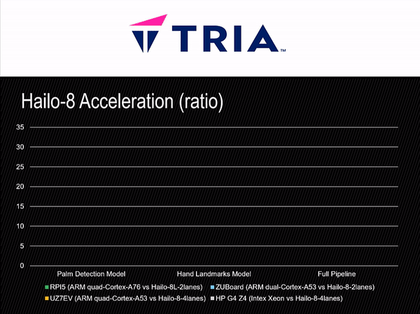

# Overview

Tutorials exploring embedded deployment of the Blaze (mediapipe) models

## Vitis-AI Inference

For more information on how to accelerate the MediaPipe models with Vitis-AI 3.5, 
please refer to the follwoing Getting Started Guide on Hackster:
http://avnet.me/mediapipe-03-vitis-ai-3.5

## Hailo-8 Inference

For more information on how to accelerate the MediaPipe models with Hailo-8, 
please refer to the follwoing Getting Started Guide on Hackster:
http://avnet.me/mediapipe-04-hailo-8

